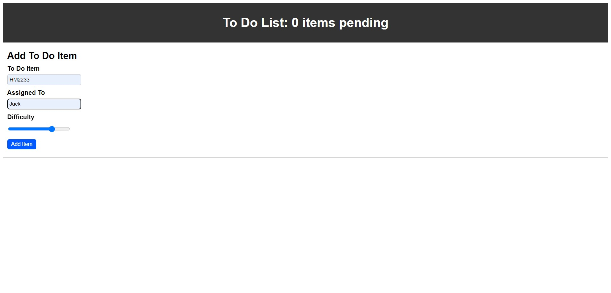
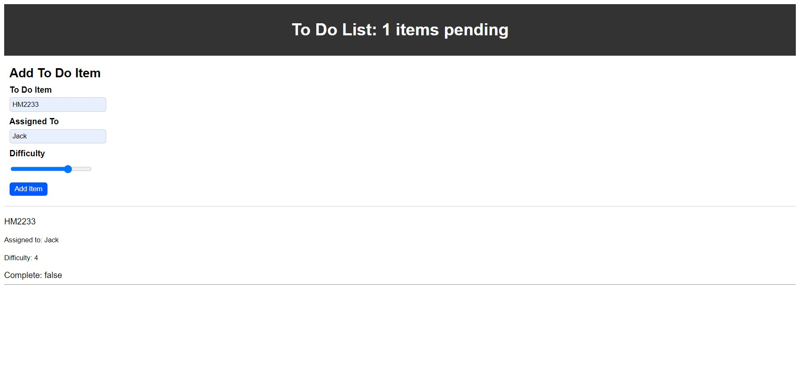
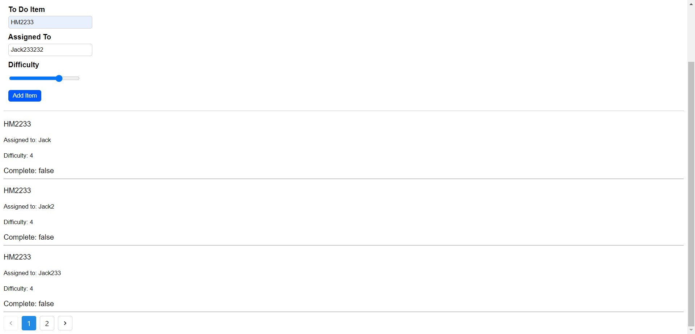
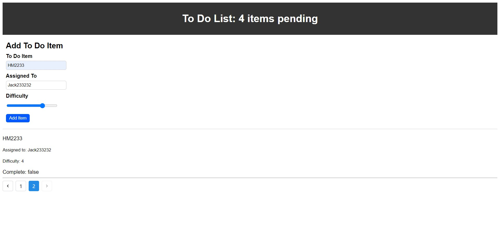

# To Do List 

.jpg)

### Context API Integration and Settings

1. Create a `settings` Context component to manage application display settings.

2. Implement the React Context API to provide settings across the entire application.

3. Create a React Context for managing application display settings and provide it at the application level.

4. Set default values for the context provider's state:
   - Display three items.
   - Hide completed items using a boolean.
   - Define "difficulty" as the default sort word.

5. Consume and utilize context values within components to customize user interactions.

### Pagination Functionality

1. Implement pagination to display a maximum of three items per screen by default in the `<List />` component.

2. Integrate the Mantine `<Pagination />` component to enable users to navigate the list of items.

3. Hide completed items in the list by default (showing completed items will be added in a later phase).

4. Manage pagination to:
    - Display only the first n items in the list, where n is the default number of items from the settings context.
    - Add "previous" and "next" buttons using the `<Pagination />` component to navigate through the list.

## Getting Started

run "npm start" to start the application

### Photos

