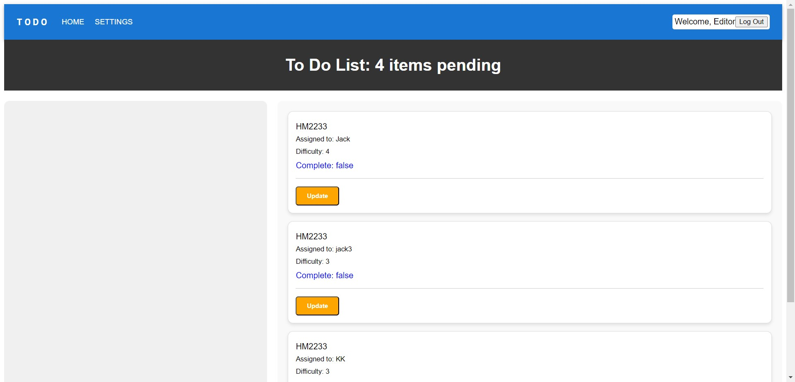

# Lab 33 

- Applying login only to start the application 

## Username and password to login 

1. username: User , password : user
- only has Read capability, and click on complete to make it true or false.

2. username: Editor , password : editor

- Read,update capability, and click on complete to make it true or false.

3. username: Writer , password : writer

- Read,update,create capability, and click on complete to make it true or false.

4. username: Administor , password : admin

- Read,update,create,delete capability, and click on complete to make it true or false.

## Setting Look

## Notes
